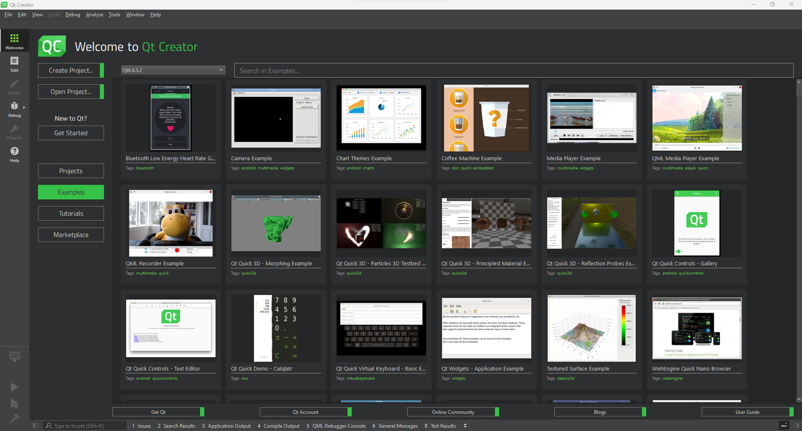
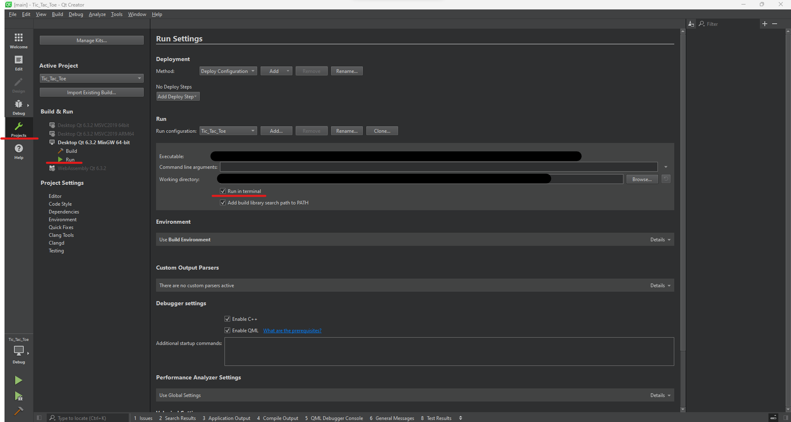
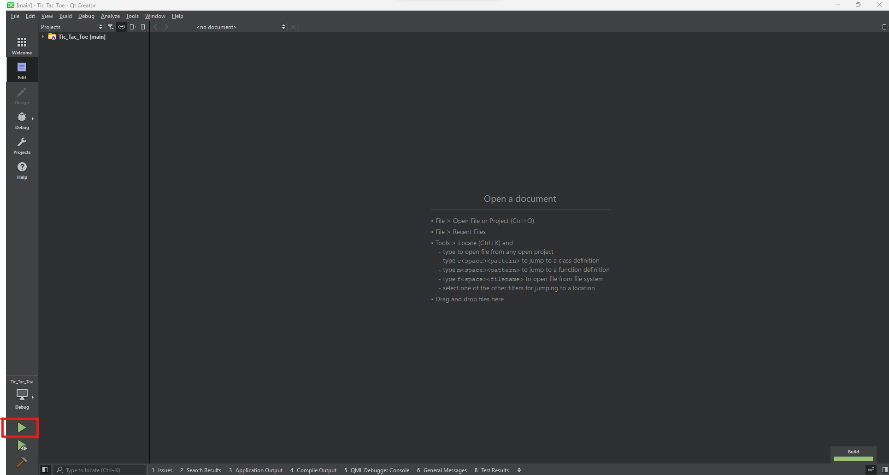

# Build manual
The project can be built in a number of ways. Which these are and how is described in the text below.

## Qt
The project can be built using Qt creator. It is supported for version 6.3.2, 6.4.0 and 6.4.1. Other versions may work. Assuming that you have installed any of these 3 version of Qt creator. 
You can download this repository and unzip the file on the desired location. Within the newly created folder, only the Tic_Tac_Toe folder is important. The other folders and files may remain but are not necessary to build the project. 
You should see a screen as shown in the image below.

\
Figure 1: Opening Qt creator

When you see this screen, click "Open project" (In the top left corner). A new window of "Windows Explorer" should open. Now use this window to navigate to the Tic_Tac_Toe folder you have just downloaded. In this folder, you will see a file named: "Tic_Tac_Toe.pro" select this file.

A new window should open in Qt creator. In this window, select "Configure Project" (bottom right). The project should open up.

When the project is open, select project on the left side. In this, select "run" on the left side. Finally, in the screen (underlined in red in the middle) check "Run in terminal". This allows you to give user input to the program.

\
Figure 2: Run in terminal

To start the program, click on "Edit" (left side) in Qt creator. Finally, click the play button (bottom left). This will launch a terminal in which you can play the game.

\
Figure 3: Run the program

You can now play the game as indicated in the ["README.md"][Link Readme]

## G++
To run the program without Qt or Docker you can use the GNU compiler. Assuming you already have it installed and it is fully functional, you only need to enter a few commands to run the program.

The first step is to download the project and unzip it to the desired location. Within the newly created folder, only the Tic_Tac_Toe folder is important. The other folders and files may remain but are not necessary to build the project. 

Open a terminal in the "Tic_Tac_Toe" folder and run the following command depending on your Operating system:

Windows:    ``` g++ *.cpp -o Tic_Tac_Toe.exe ```    To compile the game.  
            ``` Tic_Tac_Toe.exe ```                 To run the game.

Linux:      ``` g++ *.cpp -o Tic_Tac_Toe ```        To compile the game.  
            ``` ./Tic_Tac_Toe ```                   To run the game.

## Docker


[Link Readme]: https://github.com/SemKirkels/Tic_Tac_Toe_CPP/blob/main/README.md