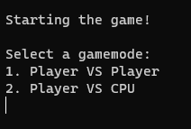
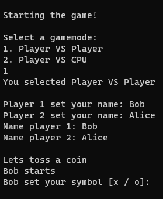
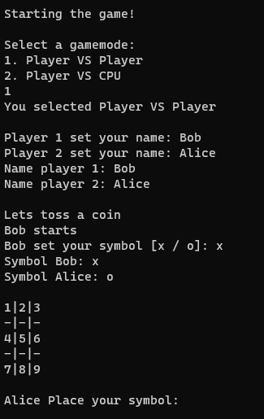

# Tic Tac Toe

## The assignment
This game is written in C++ as an assignment for the C++ course.
The requirements the assignment has to meet are in the ["Checklist.md"][Link Checklist] file.

## Build manual
The game can be run via a Docker container or on a local machine.
The exact instructions for installation can be found in the ["BuildManual.md"][Link Buildmanual] file.

## How does the game work
1. When the game starts it wil ask for the game mode. Please enter the corresponding number and press enter to confirm.

  
Figure 1: Startscreen  

2. After that it will ask each player to enter their name.

  
Figure 2: Enter names  

3. Than the program will randomly choose wich player may start selecting their symbol. This can either be 'x' or 'o' but must be lower case. The other player will receive the remaining symbol.

  
Figure 3: Enter names  

4. Finally the program will select a random player to start. Players can then take turns choosing a square to place the symbol on the field. When a player has won, this will be stated in the terminal and the game will end. A draw will end the game and state "draw" in the terminal.

  
Figure 4: Game screen  

### Errors in the game
The game will end when invalid userinput is given. This can be a wrong number or letter. The programme can be restarted when this has occurred.

[Link Checklist]: https://github.com/SemKirkels/Tic_Tac_Toe_CPP/blob/main/Doc/Checklist.md
[Link Buildmanual]: https://github.com/SemKirkels/Tic_Tac_Toe_CPP/blob/main/Doc/BuildManual.md